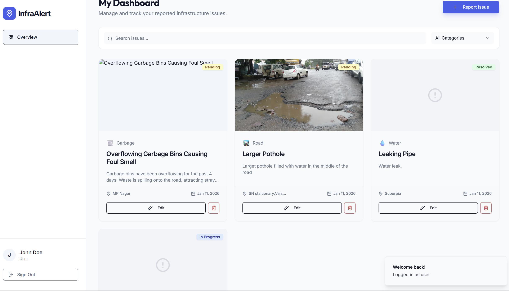
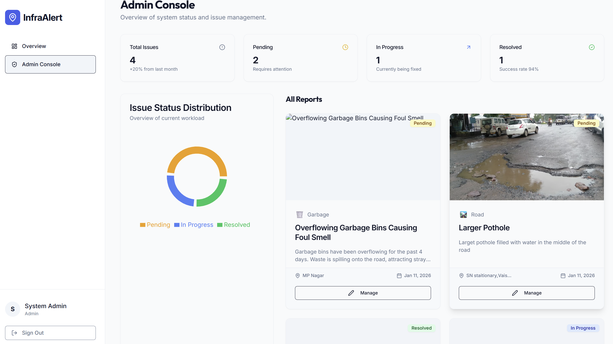

# InfraAlert

InfraAlert is a civic-tech web application that enables citizens to report, track, and resolve local infrastructure issues such as potholes, water leaks, and streetlight failures.

## Why InfraAlert?
City infrastructure issues often go unreported or unresolved due to lack of transparency.  
InfraAlert bridges the gap between citizens and local authorities by providing a simple, transparent reporting system.

---

## Features
- User authentication (Citizen / Admin roles)
- Report infrastructure issues with category & priority
- Real-time issue tracking and status updates
- Admin dashboard for issue management
- Search & filter issues
- Responsive UI (mobile-first)

---

## Tech Stack
**Frontend**
- React + TypeScript
- Tailwind CSS
- Wouter (routing)
- React Query

**Backend**
- Node.js
- Express
- Drizzle ORM
- PostgreSQL (Supabase)

---

## Getting Started (Local Setup)

### 1. Clone the repository
```bash
git clone https://github.com/nehatabassum572/InfraAlert.git
cd InfraAlert
```
### 2️. Install dependencies
```bash
npm install
```

### 3. Environment Variables
Create a .env file in the root directory:
```bash
DATABASE_URL=your_postgresql_database_url
PORT=5000
```
Never commit your .env file

### 4. Run the application
```bash
npm run dev
```

The app will be available at:
http://localhost:5000

---

## Snippets of the Website

### 1. Home Page
<p align="center">
  
</p>

### 2. Sign In
<p align="center">
  
</p>

### 3. User Dashboard
<p align="center">
  
</p>

### 4. Report Issue
<p align="center">
  
</p>

### 5. Admin Dashboard
<p align="center">
  
</p>

### 6. Admin Console
<p align="center">
  
</p>
